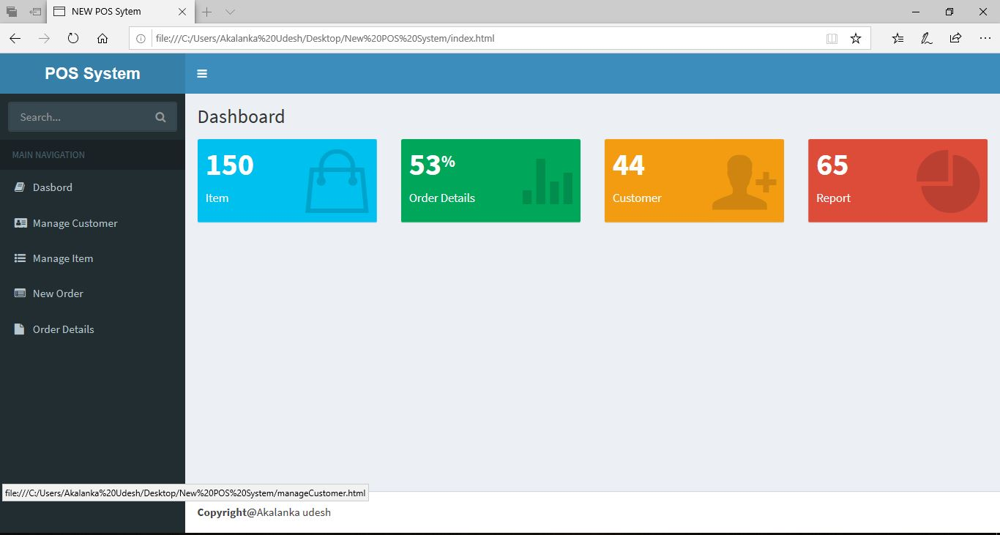
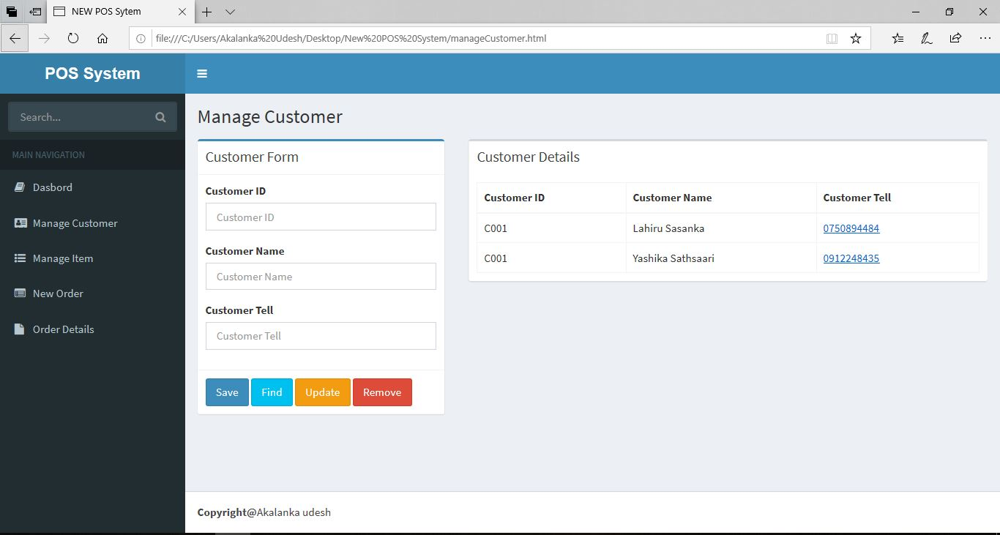
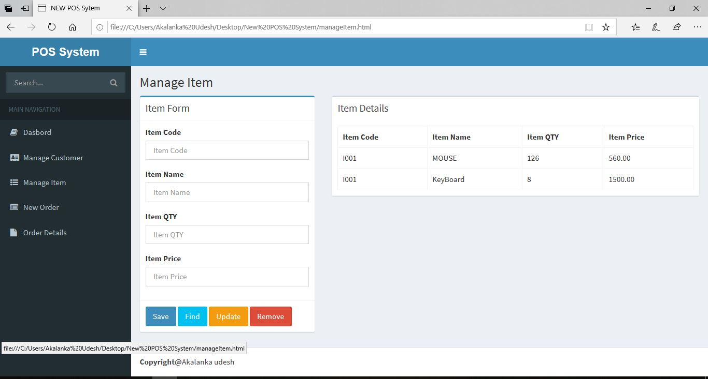
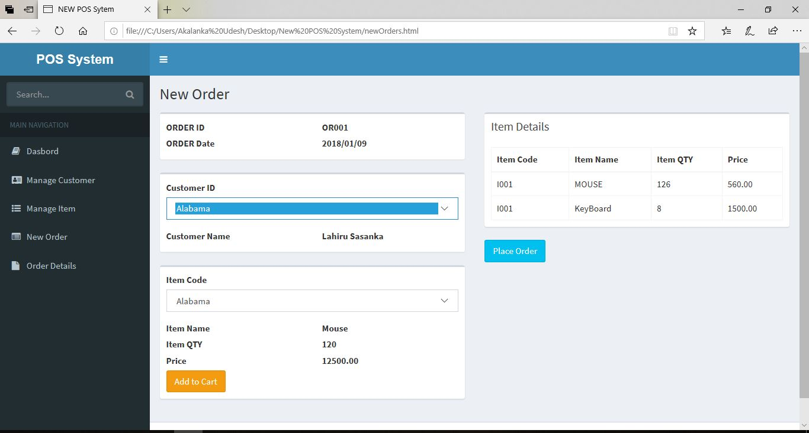
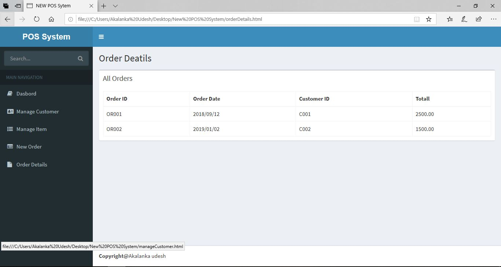

# UI DESIGN (Mobile Responsive)

This project was developed using mainly HTML,CSS,JavaScript,etc.

## Main Dashboard Design

This page showing the basic details about sales,current customers,items and Report details.

 

## Manage Customer Page

This page responsible to manage customers (add,delete,update).

 

## Manage Item Page

Manage Item Page was responsible to manage items (add,delete,update).

 

## Manage Order 

By using this page, we can handle the order processing.

 

## View Order

 

